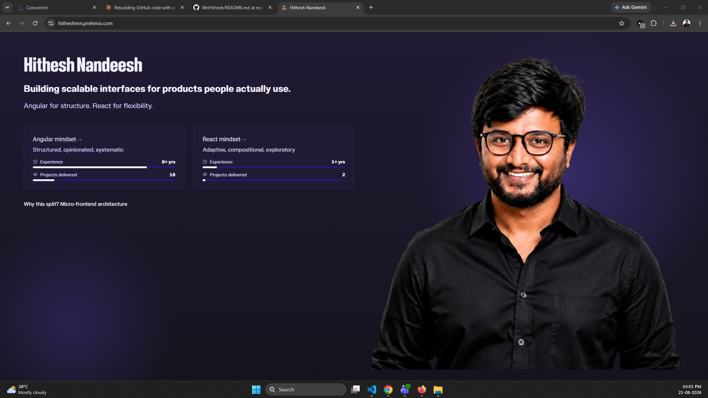

<!-- ══════════════════════ HEADER ══════════════════════ -->


<p align="center">
  <a href="https://hitheshmn.prehinix.com/">
    
  </a>
</p>

<p align="center">
  <a href="https://hitheshmn.prehinix.com/"></a>
  <a href="https://linkedin.com/in/hithesh-nandeesh"></a>
  <a href="mailto:m.n.hithesh26@gmail.com"></a>
  <a href="https://stackoverflow.com/users/8815586"></a>
  
</p>

<br/>

<!-- ══════════════════════ ABOUT ══════════════════════ -->

## 👋 About

<table>
<tr>
<td width="30%" align="center" valign="middle">
  
  <br/><br/>
  <b>Hithesh M N</b><br/>
  <sub>Bengaluru, India 🇮🇳</sub>
</td>
<td width="70%" valign="middle">

```ts
const hithesh: Engineer = {
  role:      'Senior Frontend Developer & Tech Lead',
  company:   'Delivery Centric — since Dec 2021',
  focus:     ['Angular v6 → v22', 'RxJS', 'Micro Frontends'],
  building:  'a cross-platform Ionic trading app — sole dev',
  ownership: 'interface → backend services → deployment',
};
```

I work on production systems where the frontend is the hard part — WebSocket market-data pipelines, TradingView chart integrations, custom HTML5 Canvas visualisations, and change-detection tuning on screens that update many times a second.

I own features end to end rather than handing off at the API boundary, which means the backend services, the deployment and the mobile shell too when that's what the feature needs.

</td>
</tr>
</table>

<br/>

<!-- ══════════════════════ HIGHLIGHTS ══════════════════════ -->

## 📌 Career Highlights

<table>
<tr>
<td align="center" width="25%">
  <h3>8+</h3>
  <sub>YEARS<br/>ENGINEERING</sub>
</td>
<td align="center" width="25%">
  <h3>20+</h3>
  <sub>MODULES MIGRATED<br/>ANGULAR 6 → 12</sub>
</td>
<td align="center" width="25%">
  <h3>4</h3>
  <sub>PLATFORMS BUILT<br/>FROM SCRATCH</sub>
</td>
<td align="center" width="25%">
  <h3>3</h3>
  <sub>PRODUCTS OWNED<br/>CONCURRENTLY</sub>
</td>
</tr>
</table>

- 🔄 Planned and executed a **phased Angular 6 → 12 migration** across 20+ modules solo — dependency conflicts, Material upgrade, lazy loading and modular restructuring
- 📈 Built the **real-time charting infrastructure** for a live crypto exchange: TradingView integration, WebSocket feed synchronisation, RxJS orchestration
- 🫧 Wrote a **custom HTML5 Canvas bubble visualisation** from scratch with dynamic sizing driven by live market data
- 🔁 Owned the **Copy Trading module** end to end — shared service architecture, reactive data flows, business-rule validation for automated execution
- ⚙️ Re-engineered a **futures execution engine** after breaking IIFL API changes, preserving single-, double- and four-leg order generation
- 👥 Mentor junior developers through code review and architecture discussion alongside hands-on delivery

<br/>

<!-- ══════════════════════ STACK ══════════════════════ -->

## 🧰 Tech Stack

<p align="center">
  <br/>
  <br/>
  
</p>

<p align="center">
  
  
  
  
  
  
  
  
  
</p>

<details>
<summary><b>Where I actually go deep</b></summary>

<br/>

| Area | Detail |
|---|---|
| **Angular** | v6 through v22 · standalone components · lazy routes · `provideAppInitializer` · OnPush tuning · Angular Material |
| **Reactive state** | RxJS operators, subject-based service layers, stream orchestration for live data, race and back-pressure handling |
| **Micro frontends** | Webpack Module Federation, host/remote contracts, cross-bundler ESM interop, runtime mount/unmount boundaries |
| **Real-time UI** | WebSocket feed sync, TradingView Charting Library, Highcharts, custom Canvas rendering |
| **Backend** | Node.js, Express, REST design, MongoDB, SQLite, Puppeteer scraping, alerting and notification pipelines |
| **Mobile** | Ionic, Capacitor 8, on-device SQLite, camera and local-notification plugins |
| **Delivery** | Docker, AWS (EC2, S3, Amplify), Git, code review, mentoring |

</details>

<br/>

<!-- ══════════════════════ PROJECTS ══════════════════════ -->

## 🚀 Featured Projects

<table>
<tr>
<td width="50%" valign="top">

### 🔷 Portfolio — Micro Frontend

<a href="https://hitheshmn.prehinix.com/">
  
</a>

An Angular shell owns routing, layout and lifecycle; a React remote is built independently in Vite and loaded at runtime via **Module Federation**.

The hard part is the bundler bridge — a Webpack host consuming a pure-ESM Vite bundle, with explicit mount/unmount boundaries and no shared global state.

`Angular` `React` `Vite` `Module Federation` `GSAP` `Lenis`

<a href="https://hitheshmn.prehinix.com/"></a>

</td>
<td width="50%" valign="top">

### 👕 Dresscode — Offline Wardrobe App

Android wardrobe manager on **Angular 22 + Capacitor 8**, running entirely on-device with no backend.

Catalogue pieces from camera captures, inspiration shots, tag scans or receipts; assemble and save looks; get outfit suggestions and wear-pattern insights.

SQLite persistence with a browser fallback, bootstrapped via `provideAppInitializer` so the database and preferences resolve before the first route.

`Angular 22` `Capacitor 8` `SQLite` `RxJS` `Vitest`

<a href="https://github.com/MnHithesh/dresscode-mobile"></a>

</td>
</tr>
<tr>
<td width="50%" valign="top">

### 🎯 JobFit AI — Resume Tailor Agent

Watches Gmail for recruiter emails, extracts the job description with Gemini, and produces a tailored ATS-optimised resume in under 60 seconds — then pushes match score, matched and missing skills, and improvement notes to Discord.

Three-stage pipeline (extraction → tailoring → scoring) with prompt constraints that let the model reprioritise existing content but never invent experience.

`n8n` `Gemini API` `Node.js` `Gmail IMAP` `Discord`

<a href="https://github.com/MnHithesh/ai-resume-tailor-agent"></a>

</td>
<td width="50%" valign="top">

### ⏰ Task Reminder — Self-Hosted

Browser notifications die when the browser closes, so delivery runs through a Discord bot instead — an outbound WebSocket needing no public URL, open port or TLS, so it works behind a home router.

Interactive embeds with action buttons, separate work and personal channels, and follow-up chasing for anything left unacknowledged.

Uses Node's built-in `node:sqlite` rather than `better-sqlite3`, avoiding native compilation and per-release ABI breakage.

`Node.js 24` `node:sqlite` `discord.js` `ESM`

<a href="https://github.com/MnHithesh/task-remainder"></a>

</td>
</tr>
</table>

<details>
<summary><b>💰 DuoBudget — Shared Budget Tracker for Couples</b></summary>

<br/>

Shared expense tracking, cost splitting and joint financial goals, with an OpenAI-powered assistant that analyses spending patterns and returns personalised suggestions.

`React` `Node.js` `Express` `OpenAI API`

[Frontend](https://github.com/MnHithesh/duobudget_frontend) · [Backend](https://github.com/MnHithesh/duobudget_backend)

</details>

<br/>

<!-- ══════════════════════ EXPERIENCE ══════════════════════ -->

## 💼 Experience

> Most of my strongest work is client code in private repositories, so it won't show in the contribution graph below.

<details open>
<summary><b>Senior Frontend Developer & Tech Lead</b> · Delivery Centric · <i>Dec 2021 – Present</i></summary>

<br/>

**Coin Centric / Crypto Centric** — crypto trading platform · [live](https://www.coincentric.io/home)

Led frontend architecture across a phased Angular 6 → 12 migration and a second Angular 14 application built from scratch. Implemented the platform's real-time charting through TradingView with WebSocket-driven market-data pipelines, a custom Canvas bubble visualisation, and a market-trend analytics module combining sentiment logic, RxJS orchestration and OnPush optimisation.

Owned Copy Trading end to end. On the backend, built a crypto alerting system with price and percentage triggers dispatching email and SMS, limit-order processing via Puppeteer against live NSE pricing, and a re-engineered futures execution engine after breaking IIFL API changes.

Currently sole frontend developer on a cross-platform Ionic trading app.

`Angular 12/14` `TypeScript` `RxJS` `Node.js` `WebSockets` `TradingView` `Highcharts` `Canvas` `Puppeteer` `Ionic`

<br/>

**DCPS** (CRM & workforce management) and **Math Initiative** (EdTech) · *Oct 2022 – Jun 2024*

Architected and delivered both platforms from scratch — Angular 14 structure, shared service layers, reusable component libraries and development standards. Implemented RBAC and permission-driven workflows in DCPS across recruiters, managers, sales and leadership; RxJS state management for recruitment workflows and learner progress; frontend caching to cut redundant API calls on data-heavy modules.

`Angular 14` `RxJS` `Angular Material` `Node.js` `Express` `MongoDB` `SCSS`

</details>

<details>
<summary><b>Junior Software Developer</b> · Qualitas Technologies · <i>Jul 2020 – Dec 2021</i></summary>

<br/>

**Eagle Eye Cloud** — AI/ML and computer vision platform

Built Canvas-based UI components rendering spatial data, object positions and coordinate visualisations so clients could interpret AI detection and tracking output in real time. Built analytics dashboards with Plotly.js for model-performance monitoring, and worked with backend engineers and data scientists to align frontend data contracts. Contributed UX wireframing in Adobe XD and reusable component libraries across client deliverables.

`Angular 11` `TypeScript` `RxJS` `Canvas` `Reactive Forms` `Plotly.js` `Adobe XD`

</details>

<details>
<summary><b>Software Developer</b> · Elephantree Technologies · <i>Jul 2018 – Dec 2019</i></summary>

<br/>

**Move My Goods** — logistics platform

Developed customer-facing modules on a 7-person team. Owned responsive layouts that had to hold up from older Android phones to desktop machines, since customers tracked shipments on whatever they had to hand. Led a full homepage redesign repositioning the platform from internal-tool feel to something a customer would trust with a shipment, and fixed production UI bugs on a live system with real users.

`AngularJS` `Angular 6` `JavaScript` `HTML5` `CSS3` `Bootstrap`

</details>

<details>
<summary><b>Intern</b> · Nokia Networks and Solutions · <i>Jan 2018 – Jun 2018</i></summary>

<br/>

Built a CERT vulnerability automation tool that automated security vulnerability reporting for the Nokia Security Management team.

`Docker` `Jenkins`

</details>

<br/>

**🎓 MCA** — Sri Jayachamarajendra College of Engineering, Bengaluru · 2018

<br/>

<!-- ══════════════════════ ACTIVITY ══════════════════════ -->

## 📊 Activity

<p align="center">
  
</p>

<p align="center">
  
</p>

<br/>

<!-- ══════════════════════ FOOTER ══════════════════════ -->

<p align="center">
  <i>Open to conversations about frontend architecture, real-time systems and micro frontends.</i>
</p>


